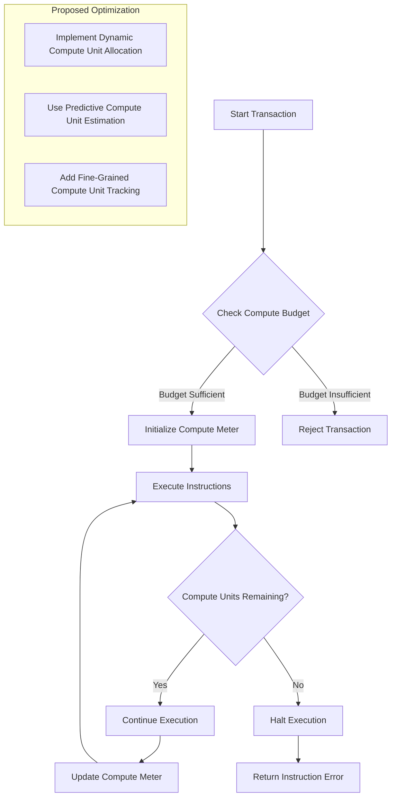
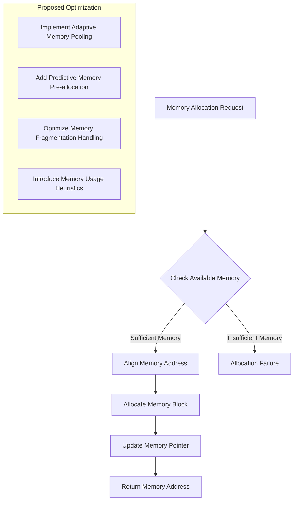
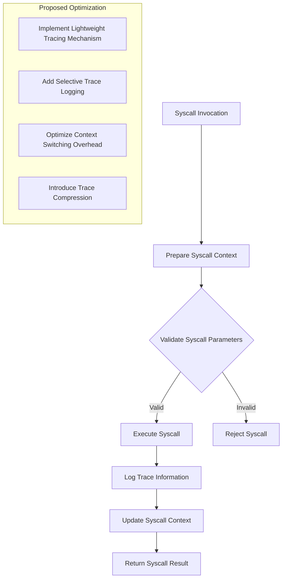

# ADV SVM Prerequisite

## Assignment Overview
This assignment is a peek into the Solana Virtual Machine (SVM) prerequisites, focusing on code analysis and optimization of the `invoke_context` codebase.

## What I did 
- Analyzed the `agave_invoke_context.rs` codebase
- Annotated and comment on the code
- Identify potential optimization areas
- Develop pseudo-code for potential improvements

## Project Structure
- `My_prereq_solution.rs`: Main solution file
- `agave_invoke_context.rs`: Core codebase for analysis
- `Task`: Project requirements document

##Optimization Areas

### 1. Compute Budget and Metering Optimization
- Implement compute unit allocation
- Develop predictive compute unit estimation
- Added compute unit tracking

#### Compute Budget Optimization Diagram

### 2. Memory Allocation and Management Optimization
- Implement adaptive memory pooling
- Add predictive memory pre-allocation
- Optimize memory fragmentation handling
- Introduce memory usage heuristics

#### Memory Allocation Optimization Diagram

### 3. Syscall Context and Tracing Optimization
- Implement lightweight tracing mechanism
- Add selective trace logging
- Optimize context switching overhead
- Introduce trace compression

#### Syscall Context Optimization Diagram
